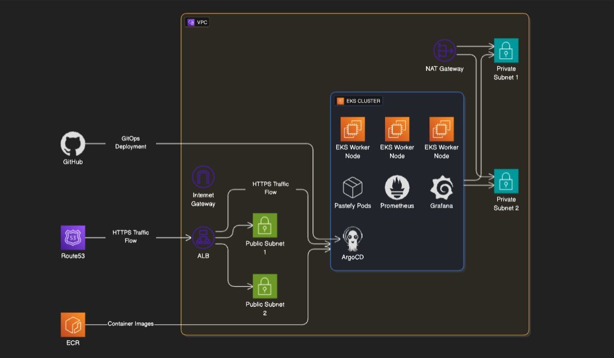
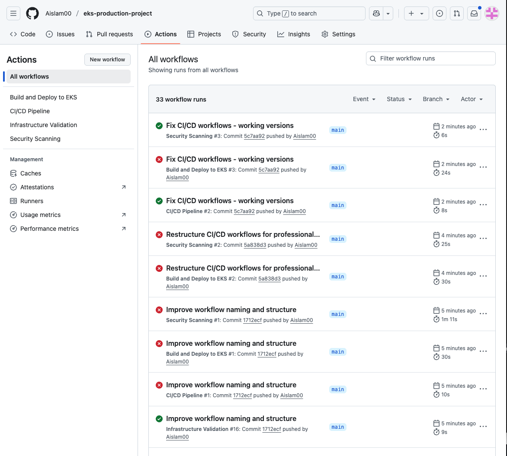

# EKS Production Project

A production-grade Kubernetes environment on AWS running a paste-sharing application (Pastefy) with complete CI/CD pipelines, monitoring, and security practices.

**Live application**: https://eks.integratepro.online

Additional interfaces:
- Grafana: https://grafana.integratepro.online  
- Prometheus: https://prometheus.integratepro.online  
- ArgoCD: https://argocd.integratepro.online  

## Overview

This project implements a complete AWS production environment for hosting a code snippet sharing application. The infrastructure uses Kubernetes (EKS) for container orchestration, Terraform for infrastructure management, and GitHub Actions for automated deployment workflows.

The system automatically builds, tests, and deploys code changes through a GitOps workflow, ensuring consistent and reliable deployments.

## Technology Stack

**AWS Infrastructure:**
- EKS for managed Kubernetes cluster
- ECR for container image storage
- Route53 for DNS management
- ACM for SSL certificate management

**Application Stack:**
- Pastefy (Node.js/Java application)
- MariaDB (database)
- Prometheus (metrics collection)
- Grafana (monitoring dashboards)
- ArgoCD (GitOps deployment)

**CI/CD Pipeline:**
- GitHub Actions for automation
- Trivy for security scanning
- Docker for containerization

## Deployment

Initialize the Terraform backend:
```bash
cd terraform/backend-setup
terraform init && terraform apply
```

Deploy the infrastructure:
```bash
cd terraform/environments/dev  
terraform init && terraform apply
```

Configure kubectl access:
```bash
aws eks update-kubeconfig --name eks-production-dev-cluster --region eu-west-2
```

Deploy applications:
```bash
kubectl apply -f k8s-manifests/pastefy/
kubectl apply -f k8s-manifests/monitoring/
kubectl apply -f k8s-manifests/argocd/
```

## Architecture




## Application Screenshots

Production application:


CI/CD pipeline execution:


Monitoring dashboard:


Metrics collection:


GitOps deployment management:


## Key Features

- End-to-end HTTPS with automated certificate management
- GitOps-based deployment workflow
- Comprehensive monitoring and alerting
- Automated security scanning in CI pipeline
- Cost-optimized infrastructure (spot instances, single NAT gateway)

This project showcases the type of infrastructure and automation practices used in production environments.