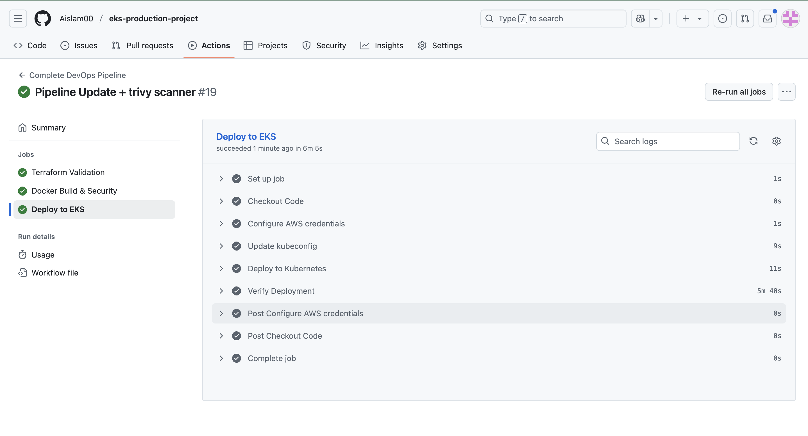

# EKS Production Project
Complete Kubernetes setup on AWS with automated deployments and monitoring.

## Table of Contents
- [What I Built](#what-i-built)
- [Tech Stack](#tech-stack)
- [Architecture](#architecture)
- [Live Application](#live-application)
- [Pipeline in Action](#pipeline-in-action)
- [Monitoring & Operations](#monitoring--operations)
- [Key Features](#key-features)
- [Getting Started](#getting-started)
- [How to Use](#how-to-use)

## What I Built
This is a production Kubernetes environment running on AWS that hosts a code-sharing app called Pastefy. The whole thing is automated - when code changes are pushed, it builds, tests, scans for security issues, and deploys automatically.

Built to demonstrate and practice real DevOps practices used in enterprise environments.

**Live site:** https://eks.integratepro.online  
**Monitoring:** https://grafana.integratepro.online  
**GitOps dashboard:** https://argocd.integratepro.online

## Tech Stack
- **Cloud:** AWS EKS, Route53, ECR
- **Infrastructure:** Terraform for everything
- **App:** Pastefy (Node.js/Java) with MariaDB
- **Automation:** GitHub Actions + ArgoCD
- **Monitoring:** Prometheus + Grafana
- **Security:** Trivy container scanning

## Architecture
The infrastructure runs on AWS with everything defined in Terraform. ArgoCD watches the Git repo and automatically deploys changes.

**AWS Infrastructure**


**Project Structure**


## Live Application

**The actual app running**


## Pipeline in Action

**Terraform validation**


**Docker build with security scan**


**Deploy to Kubernetes**


## Monitoring & Operations

**Grafana monitoring**


**Prometheus metrics**


**ArgoCD managing deployments**


## Key Features
- **Custom domain setup** - Running on my own domain with automated DNS
- **Complete automation** - Git commits trigger the entire deployment pipeline
- **Security first** - Container vulnerability scanning on every build
- **Production monitoring** - Real dashboards and metrics collection
- **HTTPS everywhere** - Automatic SSL certificates for all services
- **GitOps workflow** - All deployments managed through Git, no manual steps
- **Cost optimized** - Smart resource allocation and spot instances

## Getting Started

You'll need:
- AWS account with CLI configured
- Terraform installed
- kubectl and Docker

```bash
# Get the code
git clone https://github.com/Aislam00/eks-production-project.git
cd eks-production-project

# Set up the backend first
cd terraform/backend-setup
terraform init
terraform apply

# Build the infrastructure  
cd ../environments/dev
terraform init
terraform apply

# Connect to the cluster
aws eks update-kubeconfig --name eks-production-dev-cluster --region eu-west-2
```

## How to Use

Once everything's deployed:

```bash
# Deploy the apps
kubectl apply -f k8s-manifests/pastefy/
kubectl apply -f k8s-manifests/monitoring/
kubectl apply -f k8s-manifests/argocd/

# Check what's running
kubectl get pods -n production

# Scale the app
kubectl scale deployment pastefy-app -n production --replicas=3

# Watch logs
kubectl logs -f deployment/pastefy-app -n production
```

Any changes you make to files in `k8s-manifests/` get automatically deployed by ArgoCD.

## Notes

This project demonstrates real DevOps practices used in production environments. The infrastructure is designed to be cost-effective while maintaining production standards and scalability.

The monitoring stack provides full visibility into system performance, and the GitOps approach ensures all changes are tracked and auditable.

## Contributing

Feel free to fork this project and adapt it for your own use cases! Some ideas for enhancements:

- Add additional applications to the cluster
- Implement blue-green deployments
- Add alerting rules to Prometheus
- Set up log aggregation with ELK stack
- Experiment with different ingress controllers

Happy to discuss any questions or improvements! 🚀 ⚡