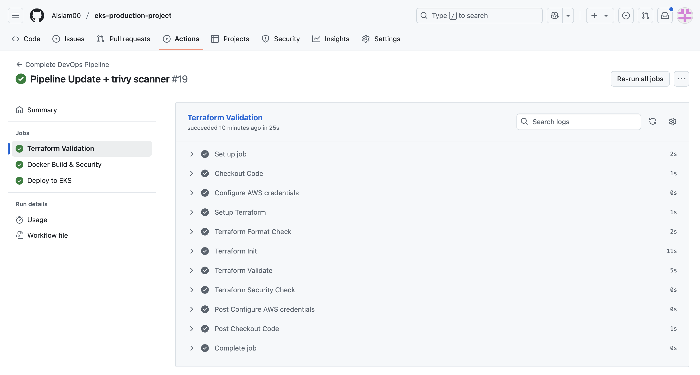

# EKS Production Platform

**Tech Stack:** Terraform, AWS EKS, GitHub Actions, ArgoCD, Prometheus/Grafana, Docker

A production-ready Kubernetes platform on AWS demonstrating enterprise DevOps practices with automated CI/CD, monitoring, and GitOps deployment.

**Live Application:** https://eks.integratepro.online  
**Monitoring:** https://grafana.integratepro.online  
**GitOps:** https://argocd.integratepro.online

## Author

**Alamin Islam**  
💼 LinkedIn: [linkedin.com/in/alamin-islam-58a635300](https://www.linkedin.com/in/alamin-islam-58a635300)  
🌐 Portfolio: [github.com/Aislam00](https://github.com/Aislam00)

## What it does

This project runs Pastefy (a code-sharing application) on AWS EKS with complete automation. When code is pushed, it automatically builds, scans for security vulnerabilities, and deploys using GitOps. The platform includes production monitoring and follows enterprise security practices.

Built to demonstrate real-world Kubernetes operations at scale.

## Architecture


**Key Components:**
- **EKS Cluster** - Kubernetes v1.28 with private worker nodes
- **Application Load Balancer** - SSL termination and traffic distribution
- **ArgoCD** - GitOps continuous deployment automation
- **Prometheus/Grafana** - Comprehensive monitoring and alerting
- **MariaDB** - Database backend for Pastefy application

## Live Application


The deployed Pastefy application running on the EKS cluster with full SSL encryption and custom domain configuration.

## Security Features


Production-ready security measures:
- **Container vulnerability scanning** - Trivy scans every Docker image build
- **Private networking** - Worker nodes in private subnets with NAT gateway access
- **IAM least privilege** - Service accounts with minimal required permissions
- **HTTPS everywhere** - Automatic SSL certificates with Let's Encrypt
- **Network policies** - Pod-to-pod communication controls

## CI/CD Pipeline



The pipeline runs three stages:

**Validation Stage** - Terraform configuration validation and Kubernetes manifest checks

**Security Stage** - Trivy vulnerability scanning and security policy validation

**GitOps Deployment** - ArgoCD automatically syncs changes from Git to cluster

Pipeline triggers on every push but requires manual infrastructure changes for proper review processes.

## How to deploy

Deploy the Terraform backend:
```bash
cd terraform/backend-setup
terraform init && terraform apply
```

Deploy the main infrastructure:
```bash
cd ../environments/dev
terraform init && terraform apply
```

Connect to the cluster:
```bash
aws eks update-kubeconfig --name eks-production-dev-cluster --region eu-west-2
```

The ArgoCD GitOps workflow handles all application deployments automatically.

## Monitoring & Operations

### Grafana Dashboard


### Prometheus Metrics


### GitOps Management


## What I Learned

**Kubernetes Operations:** Production cluster management, auto-scaling, and resource optimization with spot instances.

**GitOps Workflow:** Implementing declarative deployments with ArgoCD and maintaining infrastructure as code.

**Production Monitoring:** Setting up comprehensive observability with Prometheus, Grafana, and AlertManager.

**Cloud Security:** Container scanning, network policies, and implementing defense-in-depth strategies.

## Possible Next Implementations

- Multi-region EKS deployment for high availability
- Advanced monitoring with distributed tracing
- Blue-green deployment strategies with Flagger
- Integration with AWS Security Hub for compliance

## License

This project is licensed under the MIT License - see the [LICENSE](LICENSE) file for details.

---

**Tech Stack:** Terraform, AWS EKS, GitHub Actions, ArgoCD, Prometheus/Grafana  
**Live Platform:** https://eks.integratepro.online  
**Portfolio:** [github.com/Aislam00](https://github.com/Aislam00)