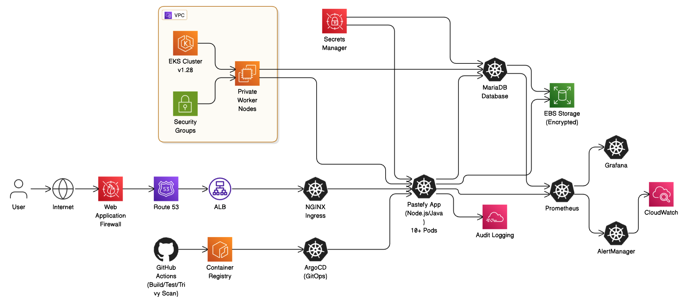
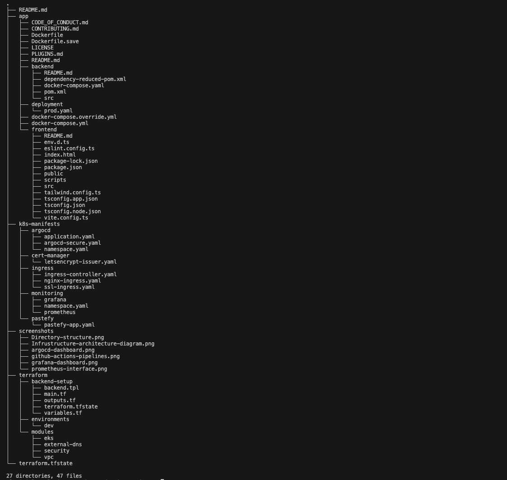
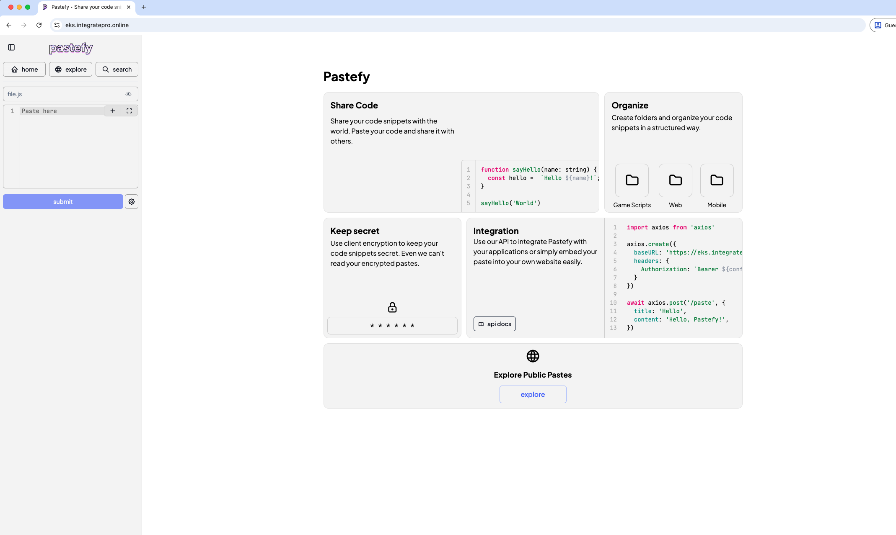
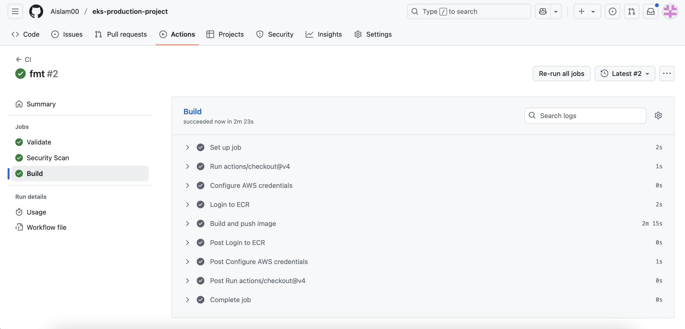
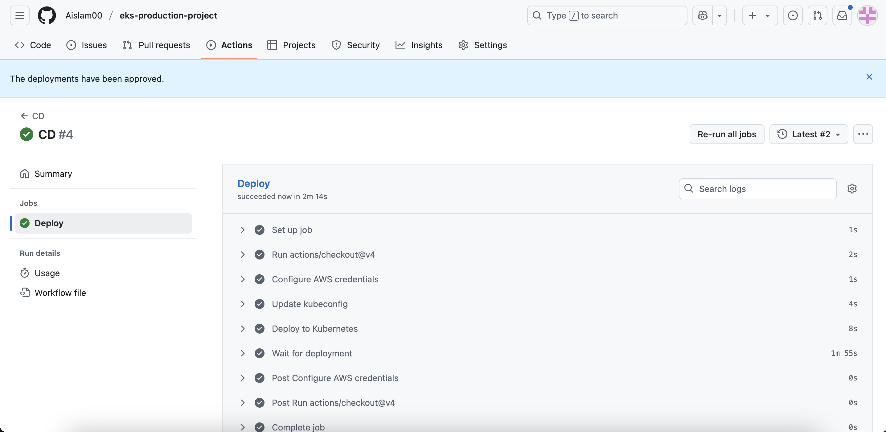
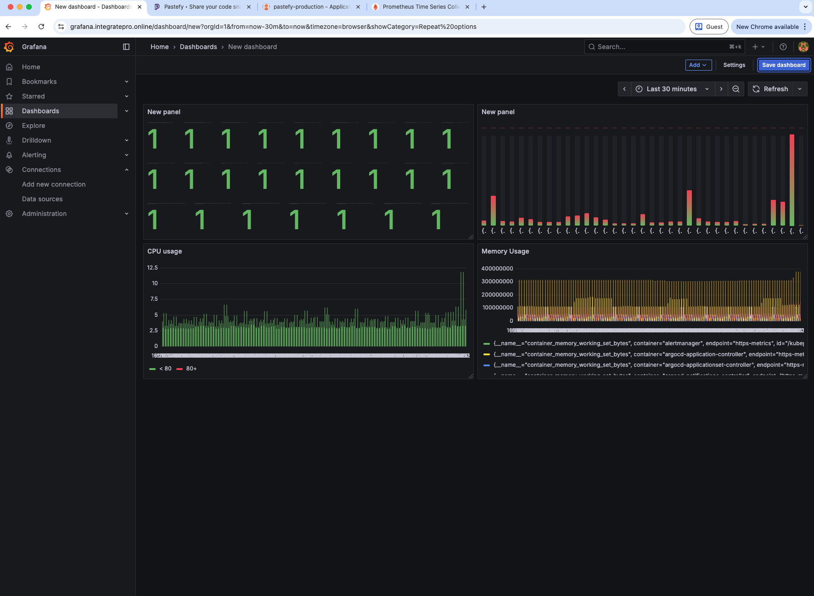
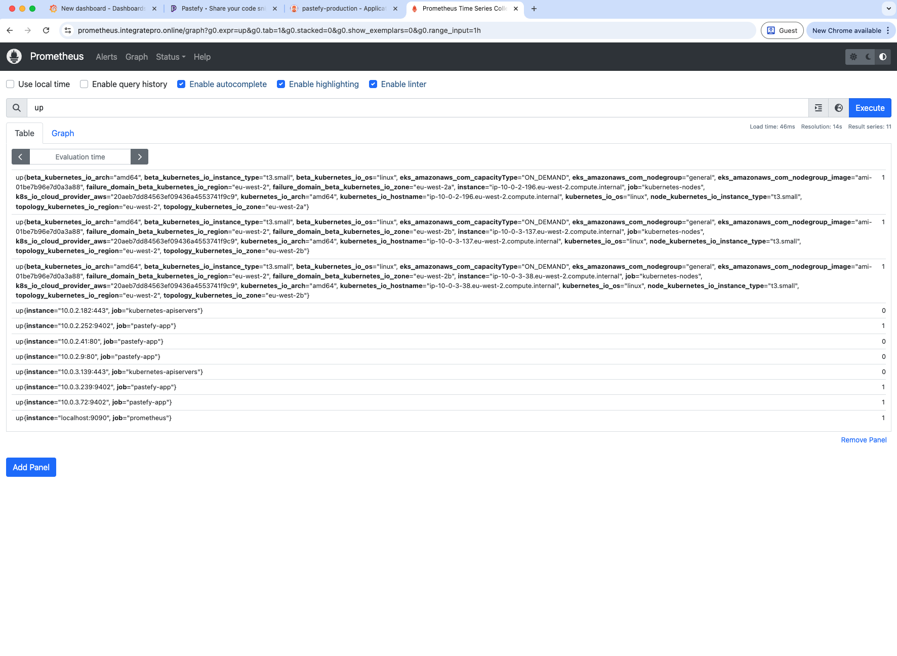
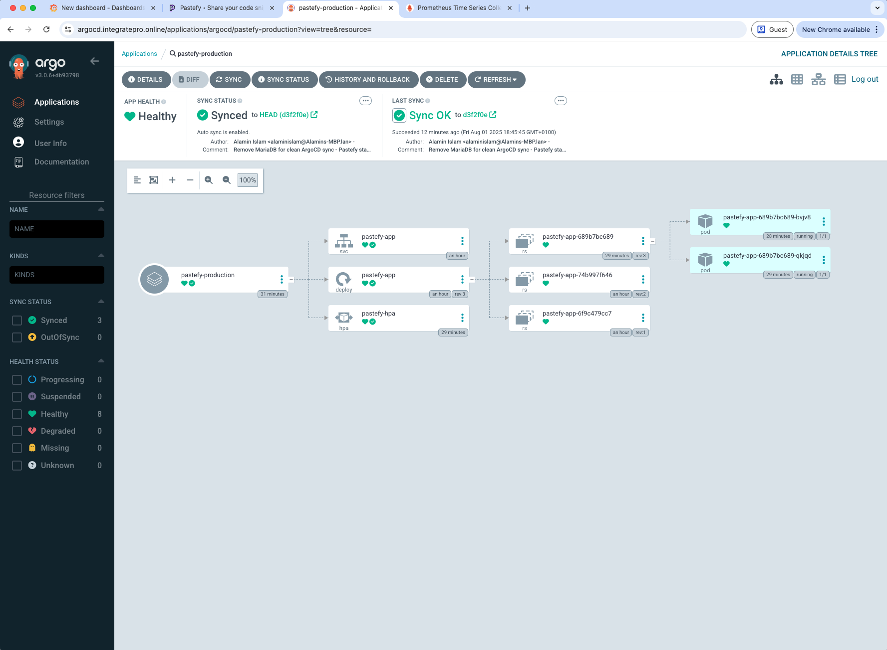

# Kubernetes Production Platform

**Built with:** Terraform, AWS EKS, GitHub Actions, ArgoCD, Prometheus/Grafana, Docker

A complete Kubernetes setup on AWS that demonstrates modern DevOps practices. The platform automatically builds, tests, and deploys a code-sharing application with comprehensive monitoring.

**Live App:** https://eks.integratepro.online  
**Monitoring:** https://grafana.integratepro.online  
**GitOps:** https://argocd.integratepro.online

## About Me

**Alamin Islam**  
💼 LinkedIn: [linkedin.com/in/alamin-islam-58a635300](https://www.linkedin.com/in/alamin-islam-58a635300)  
🌐 Portfolio: [github.com/Aislam00](https://github.com/Aislam00)

## What this does

This platform runs Pastefy (a code-sharing application) on AWS EKS. When code is pushed, it automatically builds the Docker image, scans for vulnerabilities, and deploys to Kubernetes. The setup includes monitoring and follows production security practices.

Built to demonstrate real-world Kubernetes operations and DevOps workflows.

## Getting it running

First, create the backend:
```bash
cd terraform/backend-setup
terraform init && terraform apply
```

Then deploy the infrastructure:
```bash
cd ../environments/dev
terraform init && terraform apply
```

Connect to your cluster:
```bash
aws eks update-kubeconfig --name eks-production-dev-cluster --region eu-west-2
```

ArgoCD handles application deployments automatically.

## Platform Architecture



**Core Components:**
- **EKS Cluster** - Kubernetes v1.28 with worker nodes in private subnets
- **Load Balancer** - Handles SSL termination and traffic routing
- **ArgoCD** - GitOps deployment automation
- **Monitoring Stack** - Prometheus and Grafana for observability
- **Database** - MariaDB backend for the application

## Project Structure



Terraform modules organized for reusability and environment separation.

## Application Demo



The deployed Pastefy application running on the EKS cluster with SSL encryption and custom domain.

## Security Implementation

Production security measures include:
- **Container vulnerability scanning** - Trivy scans every Docker image build
- **Infrastructure security analysis** - Checkov validates Terraform configurations
- **Network isolation** - Worker nodes in private subnets with controlled access
- **IAM role separation** - Service accounts with minimal required permissions
- **TLS encryption** - All traffic encrypted with automatic certificate management
- **Pod security policies** - Container runtime security controls

## CI/CD Pipelines

Separated workflows for build and deployment processes:

### Continuous Integration


**The CI pipeline runs on every code push:**
- **Terraform validation** - Infrastructure code format checking and validation
- **Security scanning** - Checkov infrastructure analysis and Trivy container scanning
- **Image building** - Docker image creation and ECR registry push

### Continuous Deployment


**The CD pipeline triggers after successful CI with approval requirement:**
- **Manual approval gate** - Production deployment requires human authorization
- **Kubernetes deployment** - Application manifest deployment to EKS cluster
- **Health verification** - Pod rollout monitoring and deployment status checks

The approval process ensures controlled deployments and follows production safety practices.

## Monitoring and Observability

### Application Monitoring


Grafana dashboards provide real-time visibility into application and infrastructure performance.

### Metrics Collection


Prometheus handles metrics collection and alerting for cluster health monitoring.

### GitOps Management


ArgoCD provides automated deployment synchronization with Git repository state tracking.

## Technical Learnings

This project covers end-to-end DevOps implementation including infrastructure automation, container orchestration, security scanning, and production monitoring. The platform demonstrates practical Kubernetes operations with proper CI/CD controls and comprehensive observability.

The manual approval requirement in the deployment pipeline reflects real-world production practices where deployment safety takes priority over automation speed.